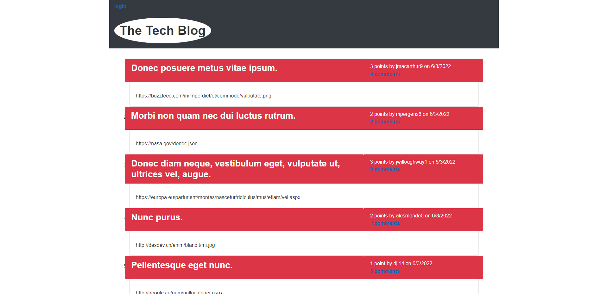
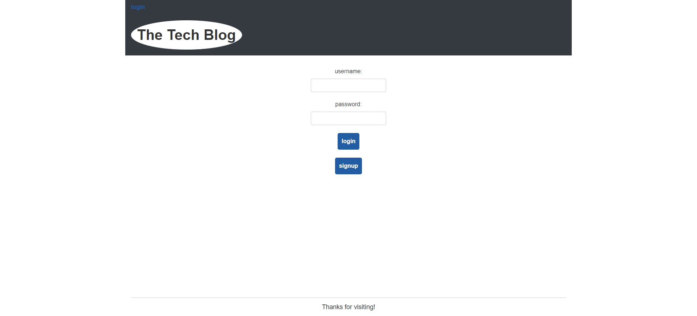
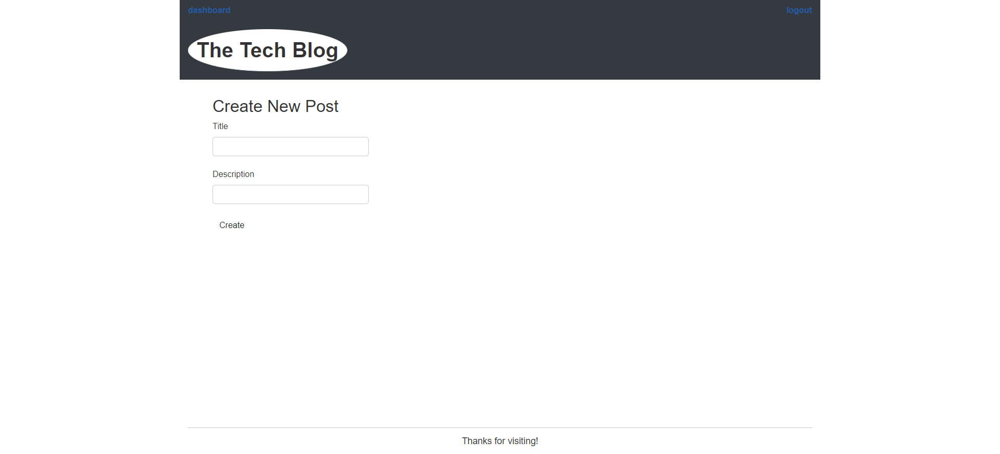
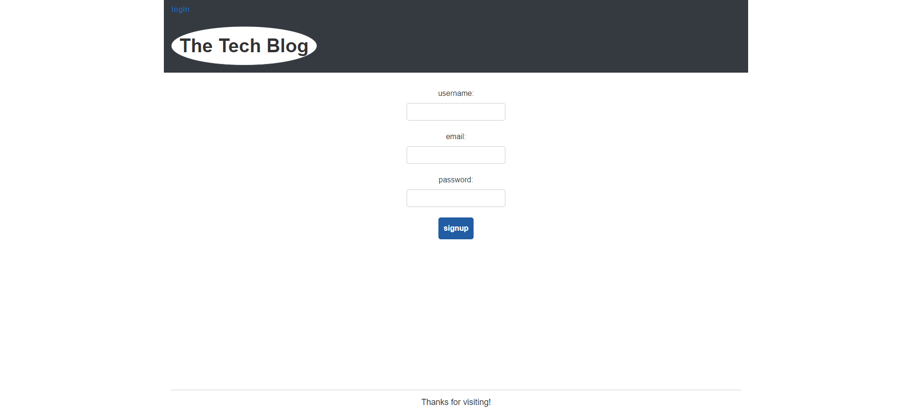

# Tech Blog

## Description

Created a blog site that uses login to post edit and delete posts.
Created to showcase tech news and mvc pattern layout.

## Table of Contents

- [Installation](#installation)
- [Usage](#usage)
- [Credits](#credits)
- [License](#license)

## Installation

run

git clone https://github.com/JaberSE09/Model-View-Controller--MVC--Challenge--Tech-Blog.git 

npm install

npm seeds

npm start

## Usage

## Credits

Sajid Jaber
